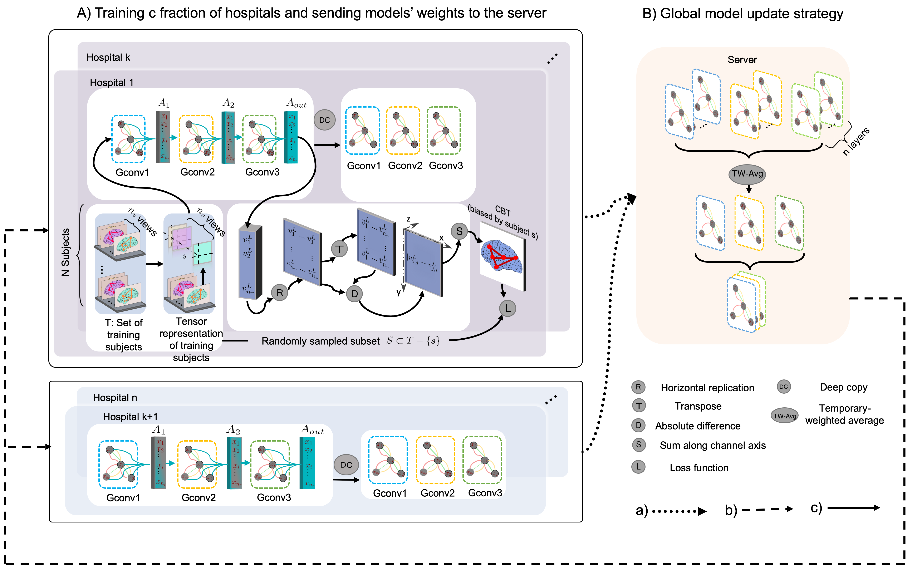
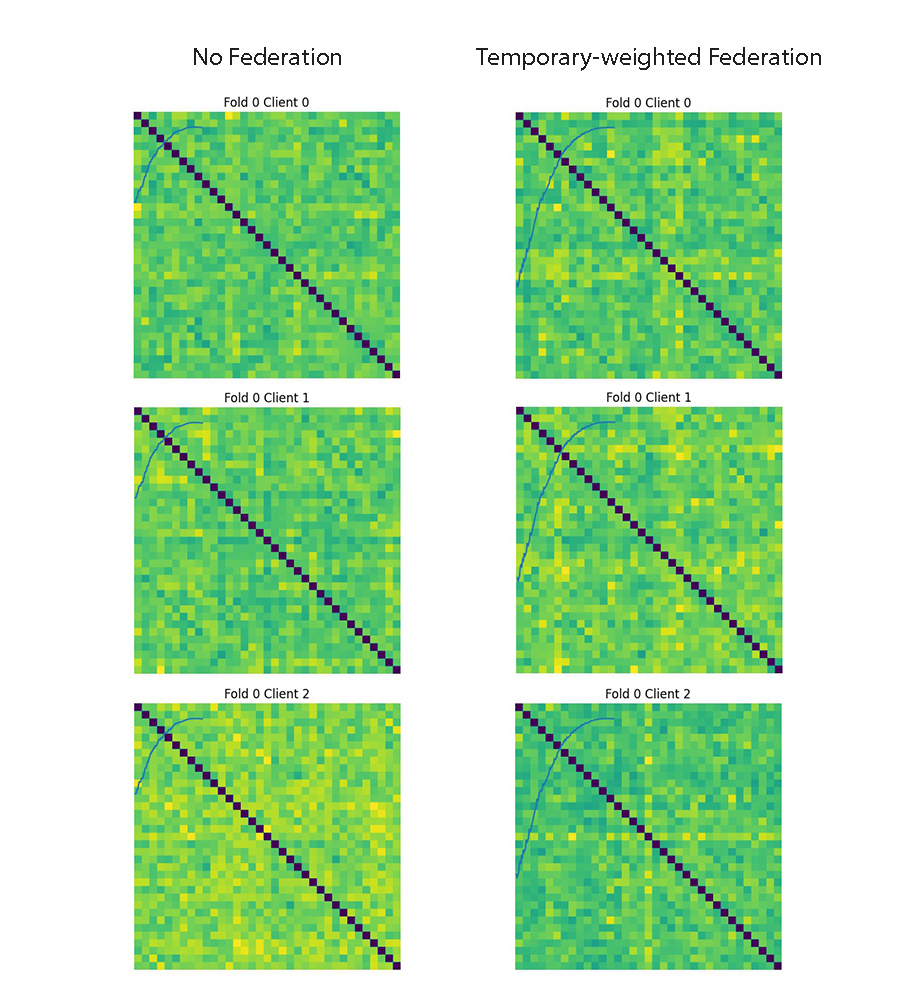

# A Federated Multigraph Integration Approach for Connectional Brain Template Learning (Fed-CBT)
Federated pipeline for integrating a set of brain connectomics into a single graph.

Please contact hizircanbayram@gmail.com for inquiries. Thanks. 



# Introduction
This work is accepted at the MICCAI 2021 workshop on  Multimodal Learning and Fusion Across Scales for Clinical Decision Support Strasbourg, France.

> **A Federated Multigraph Integration Approach for Connectional Brain Template Learninges**
>
> Hızır Can Bayram and Islem Rekik
>
> BASIRA Lab, Faculty of Computer and Informatics, Istanbul Technical University, Istanbul, Turkey
>
> **Abstract:** *The connectional brain template (CBT) is a compact representation (i.e., a single connectivity matrix) multi-view brain networks of a given population. CBTs are especially very powerful tools in brain dysconnectivity diagnosis as well as holistic brain mapping if they are learned properly –i.e., occupy the center of the given population. Even though accessing large-scale datasets is much easier nowadays, it is still challenging to upload all these clinical datasets in a server altogether due to the data privacy and sensitivity. Federated learning, on the other hand, has opened a new era for machine learning algorithms where different computers are trained together via a distributed system. Each computer (i.e., a client) connected to a server, trains a model with its local dataset and sends its learnt model weights back to the server. Then, the server aggregates these weights thereby outputting global model weights encapsulating information drawn from different datasets in a privacypreserving manner. Such a pipeline endows the global model with a generalizability power as it implicitly benefits from the diversity of the local datasets. In this work, we propose the first federated connectional brain template learning (Fed-CBT) framework to learn how to integrate
multi-view brain connectomic datasets collected by different hospitals into a single representative connectivity map. First, we choose a random fraction of hospitals to train our global model. Next, all hospitals send their model weights to the server to aggregate them. We also introduce a weighting method for aggregating model weights to take full benefit from all hospitals. Our model to the best of our knowledge is the first and only federated pipeline to estimate connectional brain templates using graph neural networks.*


## Code
This code was implemented using Python 3.8 on Ubuntu 18.04. 
```diff
 You can edit config.py file to configure our Fed-CBT method according to your needs.
```

## Installation
### *Virtualenv Installattion*
* Install pip via ```pip install virtualenv```
* Create a virtual environment via ```virtualenv mypython```
* Then activate it via ```source mypython/bin/activate```

### *Dependency Installattion*
Copy and paste following commands to install all packages (CPU version)
```sh
$ pip install pytorch==1.4.0 torchvision==0.5.0 cpuonly -c pytorch
$ pip install scikit-learn
$ pip install matplotlib
$ pip install torch-scatter==latest+cpu -f https://pytorch-geometric.com/whl/torch-1.4.0.html
$ pip install torch-sparse==latest+cpu -f https://pytorch-geometric.com/whl/torch-1.4.0.html
$ pip install torch-cluster==latest+cpu -f https://pytorch-geometric.com/whl/torch-1.4.0.html
$ pip install torch-spline-conv==latest+cpu -f https://pytorch-geometric.com/whl/torch-1.4.0.html
$ pip install torch-geometric
```


## Data format
In case you want to use Fed-CBT on your multiview networks, we represent each multiview brain network with a stacked symmetrical connectivity matrices. Therefore our model expects you to provide a path of numpy array saved as a binary file in NumPy .npy format with shape [#Subjects, #Nodes, #Nodes, #Views]. Executing ```python simulate_data.py```, we provide a simulated dataset, where a randomized dataset is split into k-fold, then training dataset of every fold is further split for every deviced introduced to the federated pipeline. Then ```python demo.py``` can be executed.

## Run Fed-CBT
To run our code, open up a terminal at Fed-CBT’s directory and type in
```sh
$ source mypython/bin/activate
$ python simulate_dataset.py
$ python demo.py
```
#####  You may edit config.py to tune hyperparameters, configure training or supply your own dataset.

## Components of Fed-CBT’s Code
| Component | Content |
| ------ | ------ |
| config.py | Includes hyperparameter and other options. You may modify it according to your needs. |
| model.py | Implementation of the model. |
| demo.py| Driver code that executes Fed-CBT in a cross-validation manner.  |
| helper.py| Includes some helper functions |
| simulate_data.py| Creates necessary simulated data for executing demo. It, first, creates an input directory and then creates the dataset in it. |
| output/dataset/strategy | After the training, this directory includes loss curves, models, CBTs for each test graph, final loss values and population CBT for each fold. |
  
## Example Result  
 <br>
The figure compares CBTs of a population of the first device's subjects in the first fold where each subject has 6 views (each represented by 35 by 35 matrix). Our code takes in a numpy array of size [37, 35, 35, 6] and outputs a 35 by 35 matrix.


## YouTube videos to install and run the code and understand how Fed-CBT works

To learn about how Fed-CBT works, check the following YouTube video: 

Coming up soon.


## Please cite the following paper when using Fed-CBT
```latex
   ...
```
